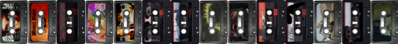

# Sunken Tapes

Sunken Tapes mod for Barotrauma

There's a Boombox.

And cassette tapes. Can you find them all?

This mod does not include any licensed music. It provides you the tools to get it and integrate it yourself, hence the somewhat convoluted installation procedure.

## Features

- Boombox that you can carry.
- Cassette tapes determine the songs.
- Play/Stop controls.
- Boombox plays sound without players needing to hold it.
- Tapes have durability and a limited number of plays.
- Energetic music gets you hyped.
- Buy and sell cassette tapes at traders. Some are available only in certain types of stations.
- Some cassette tapes are not available at merchants.
- Inspect cassette cover art.
- Throw against the wall and smash an annoying tape that your crew-mate keeps playing.

## Install

1. Download the zipped [archive](https://obzorje.kompot.si/s/WJGiitXANsHggWy/download/barotrauma-sunken-tapes.zip) and extract it.
2. Run `install.bat`.
3. Check the settings if they are correct.
4. Click on `Download`.
5. Click on `Deploy`.

### Activate the mod in the game

1. Activate the mod in Settings. Make sure that it is on the top of the list.
2. Restart the game.

### Notes

- It happened once that a song was not fully downloaded somehow. You can try to deploy again - the songs that were already downloaded are skipped next time.

- The installation instructions are for Windows 10 64-bit users. If you're a Linux user you can try to install the dependencies in `main.py` and `deploy.py` and edit the files so they don't use the embedded `exe` files, sorry :/.

## Update

1. Run `install.bat`.
2. Click on `Update`.
3. Click on `Deploy`.

## Settings

* If your Barotrauma installation directory is anywhere else than in `C:/Program Files (x86)/Steam/steamapps/common/Barotrauma` you need to specify that.

* [Into the Abyss](https://steamcommunity.com/sharedfiles/filedetails/?id=2005463692): Sunken tapes overrides the `style.xml` but it includes the small changes that *Into the Abyss* makes to the file. If you don't use *Into the Abyss* you might only get some warnings for missing files but you can also uncheck the tickbox before the installation to override the vanilla `style.xml`.

* You can turn off the buffs from the tapes.

* If your screen ratio is any other than 16:9 (e.g. 1920x1080) you should correct the resolution variables before installing.

## Some more details

Installation generally does the following:

- Downloads all the songs that are available on YouTube.
- Cuts and compresses the songs with ffmpeg.
- Assembles the covers and icons images.
- Creates the XMLs that define the mod.
- Copies all the required files in your Barotrauma install folder.

## Technical information

Many have tried to make such a mod but all got discouraged by the following issue. In multiplayer there's a desync happening during the level loading if you have items with sounds files too big (cumulatively) that are associated with an item. This results in inability to enter the game with all your friends because the server wants to load all the audio files during the level loading. Sunken Tapes mod resolves this issue by spawning invisible items with one sound file only when songs are played.

The first time someone plays a particular song in a level there will be a slight stutter for everyone because the server loads the sound. After that you can start and stop playing that song without any stutter.

## Adding your own tapes

1. Add a new entry into `tapes.yaml`. See how the other tapes are made. Beware, there be spoilers in the file!
2. Add cover and icon images to `./source/images` with names being equal to `identifier` variable in `tapes.yaml`. The resolutions have to be `512x328px` and `64x41px` respectively.
3. Run `install.bat` and click on `Deploy` again. It will assemble the png images, copy the files to `./build/` and update the mod in your game installation folder.

## Roadmap

- [ ] More loot options.
- [ ] Layered noise sounds at low durability.
- [ ] Fabricating special versions.
- [ ] Editor for adding your own tapes.
- [ ] Encounters/quests with the people from the underwater music scene on the stations.

## Support

**08080** provided original music for the mod. You can check out or buy his debut release *Astro Disco* on [08080.bandcamp.com](https://08080.bandcamp.com/).